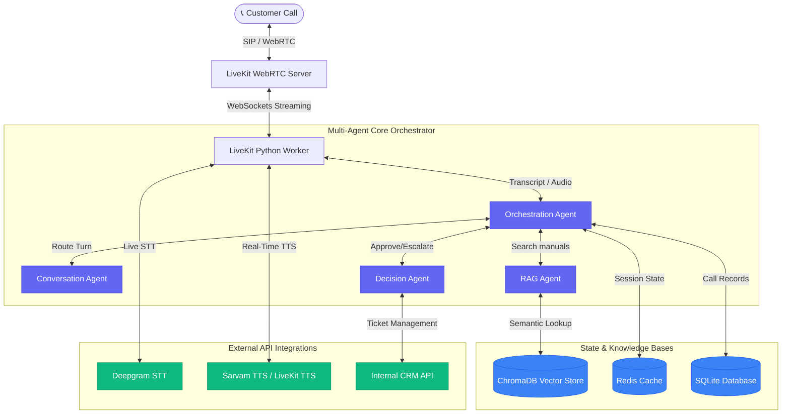

# 🎙️ Gauri: Enterprise Multi-Agent Voice Support Suite

Gauri is a state-of-the-art, production-ready, multi-agent voice support suite designed for enterprise call centers. By integrating real-time **WebSockets streaming**, a multi-agent framework (**Orchestration, RAG, and Decision Agents**), **LiveKit agent pipelines**, **Redis session caching**, and **ChromaDB vector memories**, Gauri delivers sub-second latency voice interactions tailored for high-volume customer support.

---

## 🏗️ System Architecture

Gauri's architecture utilizes a modern real-time event-driven design:



---

## ⚡ Core Features

- **Dynamic Orchestration Router:** An intelligent state-machine router managing identity verification, diagnostic collection, RAG-based query resolution, and live escalations.
- **Enterprise RAG Engine:** A local semantic retriever powered by **ChromaDB** with a pre-indexed knowledge base containing hardware manuals and troubleshooting documents.
- **Robust State & Session Caching:** Integrated **Redis** session management that secures customer variables, transaction logs, and handles circuit-breaking protocols.
- **Resilient Voice Pipe:** Live stream-to-speech pipelines supporting ultra-low latency **Deepgram STT** and native voice streaming through **LiveKit**.
- **Self-Healing Circuit Breakers:** Active tracking of external LLM / TTS service status, preventing call dropouts during upstream API bottlenecks.
- **Enterprise Test Suite:** Consolidated master runner verifying conversation trees, RAG lookups, security (PII injection guards), and latency budgets.

---

## 📂 Project Structure

```text
voice_agent/
├── app/                        # 🧠 Core Python Application
│   ├── agents/                 # Multi-agent decision logic
│   │   ├── conversation_agent.py   # Customer greeting & verification
│   │   ├── decision_agent.py       # Technical routing & ticketing
│   │   ├── orchestrator.py         # Multi-agent coordinator
│   │   └── rag_agent.py            # RAG semantic searcher
│   ├── models/                 # Database & API schema contracts
│   ├── services/               # DB and Redis caching drivers
│   ├── tools/                  # Warranty lookups & Ticket creators
│   ├── utils/                  # Circuit breakers, Loggers, and RAG loaders
│   ├── voice_pipeline/         # WebSockets STT/TTS integrations
│   ├── config.py               # Application environment loader
│   └── main.py                 # LiveKit Worker entry point
├── deployment/                 # 🚀 Production Deployment Manifests
│   └── k8s-deployment.yaml     # Kubernetes deployment configurations
├── docs/                       # 📖 Extensive Architectural Reviews & Guides
│   ├── 01_system_architecture.md
│   ├── 02_architecture_review.md
│   ├── 03_cost_breakdown.md
│   └── 05_deployment_guide.md
├── knowledge_base/             # 📚 Local manuals and pre-built Chroma stores
│   ├── documents/              # Product manuals (Inverters/Solar)
│   └── vector_store/           # Seeded database files
├── tests/                      # 🧪 Automated Interview & Regression Suite
│   ├── run_all_tests.py        # Master test runner
│   ├── test_1_conversation.py  # User verification validation
│   ├── test_2_rag.py           # RAG retrieval validation
│   └── test_5_latency.py       # Security & latency profiling
├── Dockerfile                  # Container build config
├── docker-compose.yml          # Local multi-service orchestrator
└── requirements.txt            # System dependencies
```

---

## ⚙️ Quick Start Guide

### 1. Environment Configuration
Copy `.env.example` to `.env` and fill in your API credentials:
```bash
cp .env.example .env
```
Key configuration parameters:
- `LIVEKIT_URL`, `LIVEKIT_API_KEY`, `LIVEKIT_API_SECRET`
- `DEEPGRAM_API_KEY`
- `GROQ_API_KEY` (or standard `OPENAI_API_KEY`)
- `REDIS_HOST`, `REDIS_PORT`

### 2. Local Database & Cache Setup
Ensure you have **Redis** running locally (or via Docker):
```bash
docker run -d -p 6379:6379 redis:alpine
```
Run database migrations:
```bash
python migrate_db.py
```

### 3. Build & Ingest Knowledge Base
Index the solar/inverter manuals into ChromaDB:
```bash
python index_knowledge.py
```

### 4. Running the Backend Services
You can run the Voice Agent Worker, the FastAPI REST Server, or both in parallel using the master root `main.py` launcher:
```bash
# To run the LiveKit Voice Agent Worker (Default):
python main.py

# To run the FastAPI REST Dashboard Backend:
python main.py api

# To run BOTH services in parallel simultaneously:
python main.py all
```

---

## 🧪 Running the Regression Test Suite

Gauri features a professional, end-to-end testing pipeline. You can run all technical validation scripts (agents, database state, RAG accuracy, PII sanitization, and latency profiling) in one command:

```bash
python tests/run_all_tests.py
```

For custom run configurations, check the detailed testing manifest at `tests/HOW_TO_RUN_TESTS.md`.

---

## 🚢 Containerized Production Deployment

To run Gauri inside **Docker Compose** along with its database and cache microservices:

```bash
docker-compose up --build
```

To run inside a production **Kubernetes** cluster:
```bash
kubectl apply -f deployment/k8s-deployment.yaml
```
Check our [Deployment Guide](docs/05_deployment_guide.md) for full AWS CloudWatch, SIP trunking, and high-availability setups.

#we will use aws for hosting the application.
