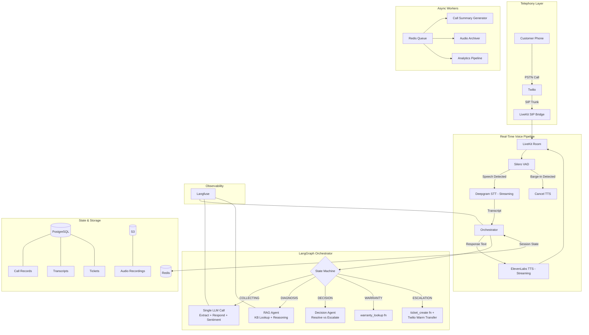

# 🔍 Architecture Review: Multi-Agent Voice Service Support System

> **Reviewer Perspective:** Senior AI Engineer with production voice-AI experience
> **Overall Assessment:** Strong foundation, but has 7 critical issues that MUST be fixed before production.

---

## ✅ What You Got RIGHT (Excellent Decisions)

| Decision | Why It's Good |
|---|---|
| Twilio → LiveKit SIP Bridge | Correct separation of telephony routing (Twilio) from real-time media (LiveKit). Industry best practice. |
| Silero VAD | Open-source, runs locally, no API cost, ~50ms latency. Perfect. |
| Deepgram Streaming STT | Sub-300ms latency, best-in-class for real-time. Correct choice over Whisper or Google. |
| Gemini 2.5 Flash | Fast inference, good structured output. Cost-effective for 50 calls/day. |
| Redis for Session State | Correct — stateless backend with externalized state. Textbook microservice pattern. |
| Slot-based Memory Model | Smart approach for structured data collection (product, serial, issue). |
| Real-time vs Async Split | Correct instinct to offload logging/summaries to background workers. |
| Langfuse Observability | Essential for debugging LLM chains in production. Good call. |
| Agent API Contract | Standardized request/response format with confidence scoring is professional. |
| Event-driven Async Processing | Correct pattern for non-blocking background tasks. |

---

## 🔴 CRITICAL ISSUES (Must Fix Before Production)

### Issue 1: Too Many LLM-Powered Agents — Latency Will Explode

**The Problem:**
You have **9 agents**. If each agent requires an LLM call, and each LLM call takes 500-800ms (Gemini Flash), chaining even 3 agents in a single turn = **1.5-2.4s just for LLM**, before adding STT + TTS time. You will **blow past your 2-second target** on every single call.

**Current Agents That Should NOT Be LLM Agents:**

| Agent | Current Design | Should Be |
|---|---|---|
| Warranty Agent | LLM-powered agent | **Simple API/DB function call** — it's just a lookup by serial_number |
| Ticketing Agent | LLM-powered agent | **Simple API function call** — structured data is already available from slots |
| Logging Agent | LLM-powered agent | **Background service/worker** — not an agent at all, it's infrastructure |
| Sentiment Agent | LLM-powered agent | **Inline classifier** — a single prompt field in the Conversation Agent's output, or a lightweight model |

**Recommended Agent Topology (5 instead of 9):**

```
┌─────────────────────────────────────────────────────┐
│              ORCHESTRATOR (LangGraph FSM)            │
│         Controls state, routes, decides next step    │
├─────────────────────────────────────────────────────┤
│                                                     │
│  LLM-POWERED AGENTS (actual reasoning needed):      │
│  ┌──────────────────┐  ┌──────────────────────────┐ │
│  │ Conversation     │  │ Information Extraction   │ │
│  │ Agent            │  │ Agent                    │ │
│  │ (generates reply,│  │ (extracts slots from     │ │
│  │  maintains tone) │  │  user utterance)         │ │
│  └──────────────────┘  └──────────────────────────┘ │
│  ┌──────────────────┐  ┌──────────────────────────┐ │
│  │ RAG/Diagnosis    │  │ Decision Agent           │ │
│  │ Agent            │  │ (resolve vs escalate)    │ │
│  │ (KB lookup +     │  │                          │ │
│  │  reasoning)      │  │                          │ │
│  └──────────────────┘  └──────────────────────────┘ │
│                                                     │
│  TOOL FUNCTIONS (no LLM needed):                    │
│  ┌──────────────┐ ┌──────────────┐ ┌─────────────┐ │
│  │ warranty_    │ │ ticket_      │ │ sentiment_  │ │
│  │ lookup()     │ │ create()     │ │ classify()  │ │
│  └──────────────┘ └──────────────┘ └─────────────┘ │
│                                                     │
│  BACKGROUND SERVICES (async, non-blocking):         │
│  ┌──────────────┐ ┌──────────────┐ ┌─────────────┐ │
│  │ Call Logger  │ │ Summary Gen  │ │ Audio Store │ │
│  └──────────────┘ └──────────────┘ └─────────────┘ │
└─────────────────────────────────────────────────────┘
```

> [!IMPORTANT]
> **Key Principle:** In a real-time voice system, every millisecond counts. Only invoke an LLM when you genuinely need *reasoning*. A warranty lookup is a database query, not a reasoning task.

---

### Issue 2: The Latency Budget Is Not Broken Down

You state `< 2 seconds` as a target but don't allocate it across components. Without a budget, you can't optimize. Here's what the real budget looks like:

```
┌──────────────────────────────────────────────────────────────┐
│                    LATENCY BUDGET (Target: < 2000ms)         │
├──────────────────────────┬───────────────────────────────────┤
│ Component                │ Budget (ms)                       │
├──────────────────────────┼───────────────────────────────────┤
│ Silero VAD (endpointing) │ 100-200ms (wait after silence)   │
│ Deepgram STT             │ 200-300ms (streaming, partial)   │
│ Network to/from LLM      │ 50-100ms                         │
│ Gemini Flash (1 call)    │ 400-700ms (streaming first token)│
│ TTS First Byte           │ 200-400ms (ElevenLabs streaming) │
│ LiveKit Audio Playout     │ 50-100ms                         │
├──────────────────────────┼───────────────────────────────────┤
│ TOTAL                    │ 1000-1800ms ✅                    │
│ BUDGET FOR AGENT LOGIC   │ ~0ms (must be negligible)        │
└──────────────────────────┴───────────────────────────────────┘
```

> [!CAUTION]
> Notice the budget for "agent logic" is essentially **zero**. This means you can only afford **ONE LLM call per user turn** in the real-time path. The Orchestrator + Information Extraction + Conversation Agent must be **combined into a single LLM call** with structured output.

**Solution: Single LLM Call with Multi-Task Output**

Instead of chaining agents, use a single Gemini call that does everything in one shot:

```json
// Single LLM call → structured output
{
  "extracted_slots": {
    "product_category": "router",
    "model": "AX-5200",
    "serial_number": null,        // null = not yet provided
    "issue": "internet keeps dropping"
  },
  "sentiment": "frustrated",
  "next_state": "COLLECT_SERIAL_NUMBER",
  "response_text": "I understand how frustrating that must be. I can see you have the AX-5200 router. Could you please provide the serial number? You'll find it on the bottom of the device.",
  "confidence": 0.85,
  "needs_rag_lookup": false
}
```

Only invoke the **RAG Agent** or **Decision Agent** as separate calls when the orchestrator *decides* it's needed (not every turn).

---

### Issue 3: State Machine Is Too Linear — Real Conversations Are Messy

**The Problem:**
Your FSM is strictly sequential:
```
GREETING → COLLECT_PRODUCT_INFO → COLLECT_ISSUE → VALIDATE → WARRANTY → DIAGNOSIS → ...
```

But in reality, a user will say:
> *"Hi, my AX-5200 router keeps dropping WiFi every 30 minutes, serial number is ABC123"*

That single utterance fills **3 slots at once** (product, issue, serial_number) and should skip straight to `CHECK_WARRANTY` or `DIAGNOSIS`. Your linear FSM would still force the system through `COLLECT_PRODUCT_INFO` → `COLLECT_ISSUE` sequentially, creating an awkward, robotic experience.

**Solution: Slot-Driven FSM, Not Step-Driven FSM**

```
                    ┌─────────────┐
                    │  GREETING   │
                    └──────┬──────┘
                           │
                    ┌──────▼──────┐
               ┌────│  COLLECTING │◄───────────┐
               │    │  (dynamic)  │            │
               │    └──────┬──────┘            │
               │           │                   │
               │    All slots filled?          │
               │    ┌──YES──┴──NO──┐           │
               │    │              │           │
               │    ▼              └───────────┘
               │  ┌──────────────┐    (ask for missing slot)
               │  │  VALIDATING  │
               │  └──────┬───────┘
               │         │
               │  ┌──────▼───────┐
               │  │CHECK_WARRANTY│
               │  └──────┬───────┘
               │         │
               │  ┌──────▼───────┐
               │  │  DIAGNOSIS   │ ◄── RAG Agent called here
               │  └──────┬───────┘
               │         │
               │  ┌──────▼───────┐
               │  │  DECISION    │
               │  └───┬──────┬───┘
               │      │      │
               │ Resolved  Escalate
               │      │      │
               │  ┌───▼──┐ ┌─▼────────┐
               │  │CLOSE │ │ESCALATION│
               │  └──────┘ └──────────┘
               │
               │ (user wants to correct info)
               └──────────────────────────┘
```

The `COLLECTING` state dynamically checks which slots are filled and only asks for what's missing. This feels human. This is what LangGraph is perfect for — conditional edges based on state.

---

### Issue 4: Missing Barge-In (Interruption) Handling

**The Problem:**
Your architecture has **zero mention** of what happens when a user interrupts the AI while it's speaking. This is the #1 cause of frustration in voice bots.

Example:
> AI: *"Let me walk you through the troubleshooting steps. First, you'll want to—"*
> User: *"I already did that!"*

If you don't handle barge-in, the AI keeps talking over the user, the user gets angry, and the call fails.

**Solution:**
```
┌─────────────────────────────────────────────────────┐
│                BARGE-IN HANDLER                      │
│                                                     │
│  1. VAD detects user speech during TTS playout      │
│  2. IMMEDIATELY stop TTS audio stream               │
│  3. Cancel remaining TTS chunks in buffer            │
│  4. Start STT on new user audio                     │
│  5. Append interrupted context to conversation:      │
│     "AI was saying: [partial text] but user          │
│      interrupted with: [new user input]"            │
│  6. Process new input normally                       │
└─────────────────────────────────────────────────────┘
```

> [!WARNING]
> Without barge-in handling, your system will feel like an IVR from 2005. This is non-negotiable for production.

---

### Issue 5: Missing Turn-Taking & Endpointing Strategy

**The Problem:**
Silero VAD tells you "speech is happening" or "silence is happening." But it does NOT tell you: **"the user is done speaking."**

Consider:
> User: *"My router is... [1 second pause] ...the AX-5200 model"*

A naive VAD implementation would trigger STT after the 1-second pause, cutting off the user mid-sentence. This creates broken transcriptions and terrible user experience.

**Solution: Configurable Endpointing**

```python
ENDPOINTING_CONFIG = {
    "min_silence_duration_ms": 700,     # Wait 700ms of silence before assuming user is done
    "max_speech_duration_ms": 30000,    # Force-stop after 30s (prevent infinite speech)
    "interim_results": True,            # Use Deepgram interim results for early processing
    "utterance_end_ms": 1000,           # Deepgram's UtteranceEnd feature as backup
}
```

Use **Deepgram's `utterance_end_ms`** feature combined with Silero VAD for robust endpointing. LiveKit's agent framework has built-in support for this.

---

### Issue 6: Missing Audio Recording & Knowledge Base Strategy

**Audio Recording:**
You mention logging transcripts but **never mention recording the raw audio**. For production you MUST record audio for:
- QA review of bad calls
- Compliance/legal requirements  
- Training data to improve the system
- Dispute resolution

**Knowledge Base:**
Your RAG Agent "queries knowledge base" but you never define:
- What technology? (Vector DB like ChromaDB/Pinecone? Or structured FAQ database?)
- How is it populated and updated?
- What's the chunking/embedding strategy?

**Recommendation:**
```
Knowledge Base Stack:
├── ChromaDB or Pinecone (vector store)
├── Embedding Model: text-embedding-3-small (OpenAI) or Gemini Embeddings
├── Document Loader: Product manuals, FAQ PDFs, troubleshooting guides
├── Chunking: 512 tokens, 50-token overlap
└── Update Strategy: Admin API to upload new documents
```

---

### Issue 7: Sentiment Should Be Real-Time, Not Async

**The Problem:**
You've placed Sentiment Analysis in the async/background queue. But sentiment detection is **critical for real-time decision-making**:

- If user is **frustrated** → change agent tone to be more empathetic
- If user is **angry** → fast-track to escalation, don't make them repeat info
- If user is **confused** → slow down, use simpler language

If sentiment runs async (after the call), you've lost the window to act on it.

**Solution:** Make sentiment a field in the single LLM call output (as shown in Issue 2). Gemini can classify sentiment as part of its response at zero additional latency cost.

---

## 🟡 MODERATE ISSUES (Should Fix)

### Issue 8: Missing Health Checks & Circuit Breakers

For production, every external dependency must have:

```python
CIRCUIT_BREAKER_CONFIG = {
    "deepgram": {"timeout_ms": 5000, "retry_count": 2, "fallback": "google_stt"},
    "gemini":   {"timeout_ms": 3000, "retry_count": 1, "fallback": "static_response"},
    "elevenlabs": {"timeout_ms": 3000, "retry_count": 1, "fallback": "deepgram_tts"},
    "redis":    {"timeout_ms": 1000, "retry_count": 2, "fallback": "in_memory_state"},
}
```

Add a `/health` endpoint that checks all dependencies and returns status.

---

### Issue 9: Missing Cost Estimation

At 50 calls/day, 3 min avg:

| Service | Rate | Daily Cost | Monthly Cost |
|---|---|---|---|
| Twilio (inbound) | $0.0085/min | $1.28 | ~$38 |
| LiveKit Cloud | $0.004/min | $0.60 | ~$18 |
| Deepgram STT | $0.0043/min | $0.65 | ~$19 |
| ElevenLabs TTS | $0.18/1000 chars (~$0.024/min) | $3.60 | ~$108 |
| Gemini Flash | ~$0.001/call | $0.05 | ~$2 |
| Redis (managed) | flat | - | ~$15 |
| PostgreSQL (managed) | flat | - | ~$15 |
| **TOTAL** | | **~$6.18/day** | **~$215/month** |

> [!TIP]
> ElevenLabs is your biggest cost driver. Consider **Deepgram TTS** (Aura) as a cheaper alternative at $0.0065/min that's still high quality, or use ElevenLabs only for the greeting and Deepgram TTS for the rest.

---

### Issue 10: Missing Live Human Handoff Path

Your architecture mentions "escalation" and "ticket creation" but **never mentions live-transferring the call to a human agent**. For production customer support:

```
ESCALATION OPTIONS:
├── Option A: Create ticket + end call (what you have now)
├── Option B: Warm transfer to human agent via Twilio  ← MISSING
│   ├── AI summarizes the call for the human agent
│   ├── Twilio dials the human agent
│   ├── Three-way bridge: AI hands off context, then drops
│   └── Human continues the call
└── Option C: Schedule callback
```

At minimum, implement Option B using Twilio's `<Dial>` verb for warm transfers.

---

### Issue 11: Agent API Contract Missing Conversation History

Your agent request contract is:
```json
{
  "call_id": "string",
  "state": {},
  "input": {},
  "metadata": {}
}
```

This is missing `conversation_history`. Without it, each agent call is stateless and has no context of what was said before. You need:

```json
{
  "call_id": "string",
  "state": {},
  "input": {},
  "metadata": {},
  "conversation_history": [         // ← ADD THIS
    {"role": "user", "content": "..."},
    {"role": "assistant", "content": "..."}
  ],
  "turn_number": 5                  // ← ADD THIS
}
```

---

## 🟢 MINOR SUGGESTIONS

| # | Suggestion |
|---|---|
| 12 | Add **call recording consent announcement** at the start: "This call may be recorded for quality purposes." (Legal requirement in many jurisdictions) |
| 13 | Add **max turn limit** (e.g., 20 turns). If the conversation goes beyond this, gracefully escalate. Prevents infinite loops. |
| 14 | Add **profanity/abuse detection**. If user becomes abusive, the system should respond with a polite boundary: "I understand you're frustrated. Let me connect you with a supervisor." |
| 15 | Add **concurrent call limit** to the architecture spec. 50 calls/day ≠ 50 concurrent. Estimate peak = 5-8 concurrent. Size your infrastructure accordingly. |
| 16 | Consider **WebSocket dashboard** for live monitoring — see active calls, agent states, and sentiment in real-time. |

---

## 📋 FINAL REVISED ARCHITECTURE SUMMARY



---

## ✅ Action Items Before We Build

| # | Action | Priority |
|---|---|---|
| 1 | Merge 9 agents → 4 LLM agents + 3 tool functions + 3 background services | 🔴 Critical |
| 2 | Redesign FSM from linear to slot-driven (dynamic collecting state) | 🔴 Critical |
| 3 | Add barge-in handling to the voice pipeline spec | 🔴 Critical |
| 4 | Define endpointing strategy (VAD + Deepgram utterance_end) | 🔴 Critical |
| 5 | Add latency budget breakdown per component | 🔴 Critical |
| 6 | Use single LLM call for extraction + response + sentiment | 🔴 Critical |
| 7 | Make sentiment real-time (part of LLM output, not async) | 🔴 Critical |
| 8 | Add conversation_history to agent API contract | 🟡 Moderate |
| 9 | Define Knowledge Base technology and strategy | 🟡 Moderate |
| 10 | Add circuit breaker pattern for all external APIs | 🟡 Moderate |
| 11 | Add audio recording pipeline (raw audio → S3) | 🟡 Moderate |
| 12 | Design live human handoff via Twilio warm transfer | 🟡 Moderate |
| 13 | Estimate and optimize monthly cost (~$215/mo at 50 calls/day) | 🟢 Minor |
| 14 | Add call recording consent, max turn limit, abuse detection | 🟢 Minor |
